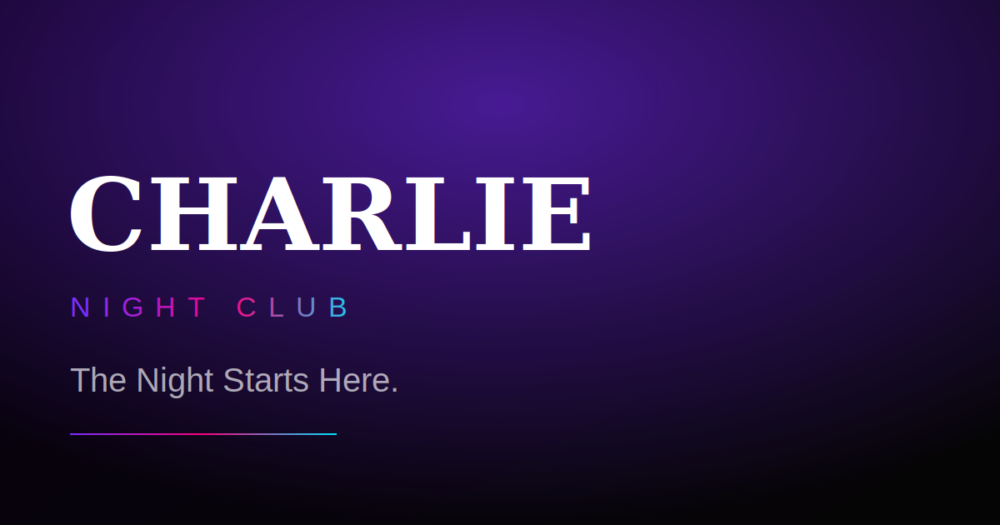

# Charlie Night Club — The Night Starts Here

An ultra-premium nightlife **digital experience**, not just a website. Built as an
Awwwards-level showcase piece for a portfolio: dark luxury, neon reflections,
cinematic motion and a living WebGL atmosphere.

> _Apple × Cyberpunk 2077 × Tomorrowland × Porsche_



## ✦ Highlights

- **11 fully-built sections** — hero, pinned cinematic story scroll, stacking
  experience cards, horizontal events gallery, 3D resident-DJ showcase, parallax
  masonry gallery, VIP storytelling, animated counters, glass testimonial
  carousel, magnetic final CTA and a premium footer.
- **Living WebGL background** — a mouse-reactive Three.js / R3F scene with a neon
  particle cloud, swaying additive light beams, fog and a parallax camera rig.
- **Choreographed motion** — Lenis smooth scroll wired into GSAP ScrollTrigger
  (section pinning, horizontal scroll, scrubbed timelines), Framer Motion
  character/word reveals, 3D card tilts, magnetic buttons and a custom cursor.
- **Premium details** — loading sequence with curtain reveal, scroll progress bar,
  dynamic navbar with active-section tracking, ambient Web-Audio toggle,
  back-to-top, custom scrollbar and reduced-motion support.
- **Production quality** — TypeScript throughout, reusable components, SEO,
  Open Graph, JSON-LD structured data, sitemap and robots.

## ✦ Tech Stack

| Layer        | Tools |
| ------------ | ----- |
| Framework    | Next.js 15 (App Router), React 19, TypeScript |
| Styling      | Tailwind CSS, custom design tokens, glassmorphism |
| Motion       | GSAP + ScrollTrigger, Lenis, Framer Motion |
| 3D / WebGL   | Three.js, React Three Fiber, Drei |

## ✦ Getting Started

```bash
npm install
npm run dev      # http://localhost:3000
```

Build for production:

```bash
npm run build && npm start
```

## ✦ Project Structure

```
app/            App Router entry, layout, global styles, robots & sitemap
components/
  layout/       Shell, preloader, navbar, footer
  sections/     The 11 page sections
  ui/           Reusable primitives (cursor, reveal, magnetic button, …)
hooks/          Lenis, magnetic, mouse, active-section
animations/     GSAP setup & text-splitting helpers
three/          WebGL canvas + night scene
lib/            Content data & utilities
metadata/       SEO config & structured data
types/          Shared TypeScript types
```

## ✦ Design System

| Token       | Value |
| ----------- | ------ |
| Background  | `#050505` |
| Secondary   | `#0D0D0D` |
| Accent 1    | `#7B2EFF` (violet) |
| Accent 2    | `#FF0080` (magenta) |
| Accent 3    | `#00E5FF` (cyan) |
| Accent 4    | `#FFD700` (gold) |

---

Imagery via [Unsplash](https://unsplash.com). Crafted for the night. 🖤
